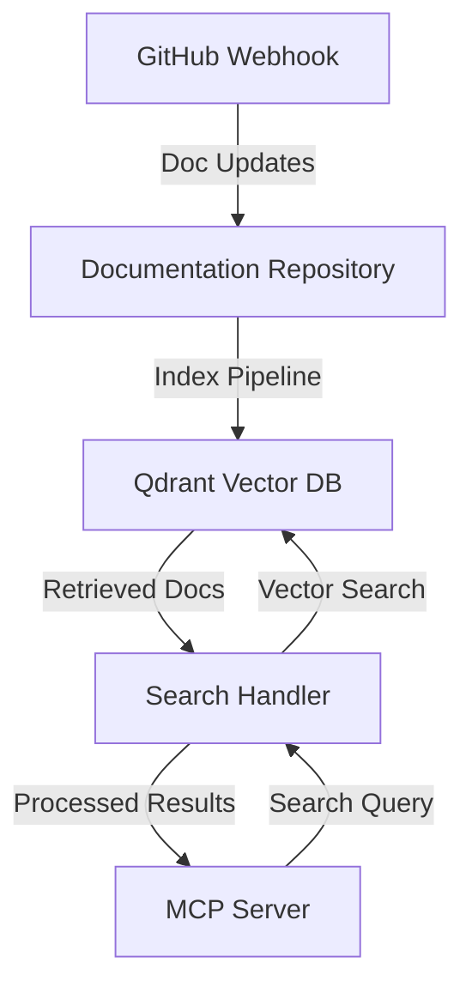

# Jito Docs Search MCP

A powerful documentation search service using RAG (Retrieval Augmented Generation) built on top of the MCP infrastructure.

## Overview

This MCP provides semantic search capabilities for Jito's documentation using:
- Qdrant as the vector database
- OpenAI embeddings for semantic understanding
- Automatic indexing through GitHub workflows
- Real-time search via MCP endpoints

## Architecture



## Getting Started

### Prerequisites

- Node.js >= 18
- pnpm
- Docker (for local Qdrant)
- OpenAI API key
- GitHub fine-grained access token

### Installation

```bash
# Clone the repository
git clone https://github.com/your-org/jito-mcp
cd jito-mcp

# Install dependencies
pnpm install

# Setup environment variables
cp .env.example .env
# Edit .env with your credentials
```

### Local Development

1. Start Qdrant:
```bash
docker-compose up -d qdrant
```

2. Run the development server:
```bash
pnpm dev
```

3. Test the search endpoint:
```bash
curl -X POST http://localhost:3000/api/search \
  -H "Content-Type: application/json" \
  -d '{"query": "How to stake SOL?"}'
```

## Configuration

### GitHub Token Setup

1. Go to GitHub Settings -> Developer Settings -> Personal Access Tokens -> Fine-grained tokens
2. Create new token:
   - Name: "Jito Docs Indexer"
   - Repository access: "Only select repositories"
   - Select both:
     - Your MCP repository
     - jito-foundation/jito-omnidocs
   - Permissions:
     - Repository permissions:
       - Contents: Read
       - Metadata: Read

### Environment Variables

```env
QDRANT_URL=http://localhost:6333
QDRANT_API_KEY=your-qdrant-api-key
OPENAI_API_KEY=your-openai-api-key
GITHUB_TOKEN=your-fine-grained-token
```

### Qdrant Collection Schema

```typescript
interface DocChunk {
  id: string;
  content: string;
  metadata: {
    path: string;
    section: string;
    title: string;
    lastUpdated: string;
  };
  embedding: number[];
}
```

## Indexing Documentation

### Automatic Indexing (GitHub Workflow)

Documentation is automatically indexed when:
- Every 6 hours via scheduled workflow
- Manually triggered through GitHub Actions
- Webhook triggered from docs repository

To manually trigger reindexing:
```bash
pnpm run index-docs
```

### Manual Indexing

For local development or one-time indexing:

```bash
# Index all documentation
pnpm run index-docs

# Index specific section
pnpm run index-docs --section jitosol
```

## Usage

### MCP Integration

```typescript
import { mcpClient } from '@jito-labs/mcp-core';

const results = await mcpClient.jito_docs_search({
  query: "How do I stake SOL for JitoSOL?",
  section: "jitosol", // optional
  limit: 5 // optional
});
```

### Response Format

```typescript
{
  results: [
    {
      content: string;
      score: number;
      metadata: {
        path: string;
        section: string;
        title: string;
        lastUpdated: string;
      }
    }
  ]
}
```

## Development

### Project Structure

```
jito-mcp/
├── packages/
│   ├── docs-search/           # Main MCP package
│   │   ├── src/
│   │   │   ├── index.ts      # MCP entry point
│   │   │   ├── search.ts     # Search implementation
│   │   │   ├── indexer/      # Document indexing
│   │   │   ├── db/          # Database operations
│   │   │   └── utils/       # Utilities
│   │   ├── tests/
│   │   └── package.json
│   └── shared/              # Shared utilities
├── scripts/
├── docker/
└── package.json
```

### Adding New Features

1. Create a feature branch
2. Implement changes
3. Add tests
4. Submit PR

### Running Tests

```bash
# Run all tests
pnpm test

# Run specific test
pnpm test search
```

## Monitoring & Maintenance

### Health Checks

Monitor the service health at:
- `/health` - Service health
- `/metrics` - Prometheus metrics

### Common Issues

1. **Slow Search Response**
   - Check Qdrant connection
   - Verify embedding generation

2. **Failed Indexing**
   - Check GitHub webhook logs
   - Verify OpenAI API access
   - Review document processing logs

## Contributing

1. Fork the repository
2. Create your feature branch
3. Commit your changes
4. Push to the branch
5. Create a new Pull Request

## License

[Add your license here] 